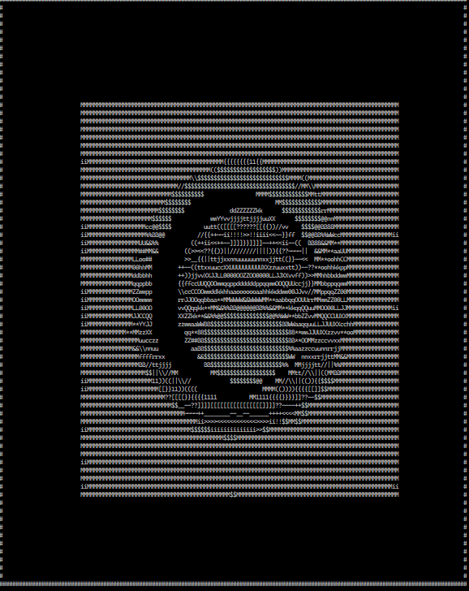

# ASCII-3D
ASCII (pure console) 3D renderer. Small weekend-project of mine.

I used my long-ago written [shader](https://www.shadertoy.com/view/ltGBRW) which utilizes raymarching technique as a test case.  

